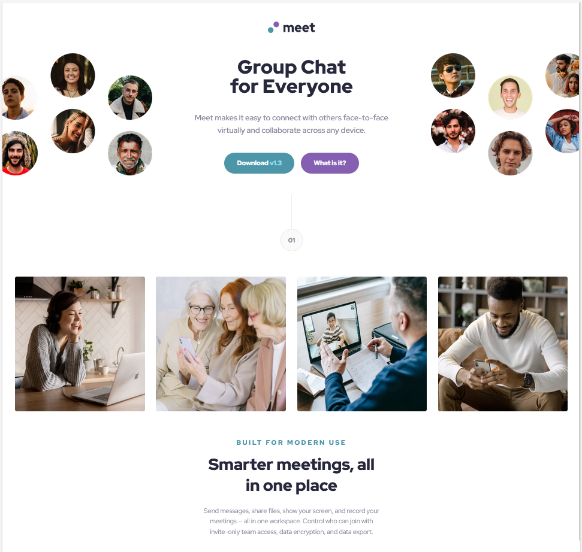
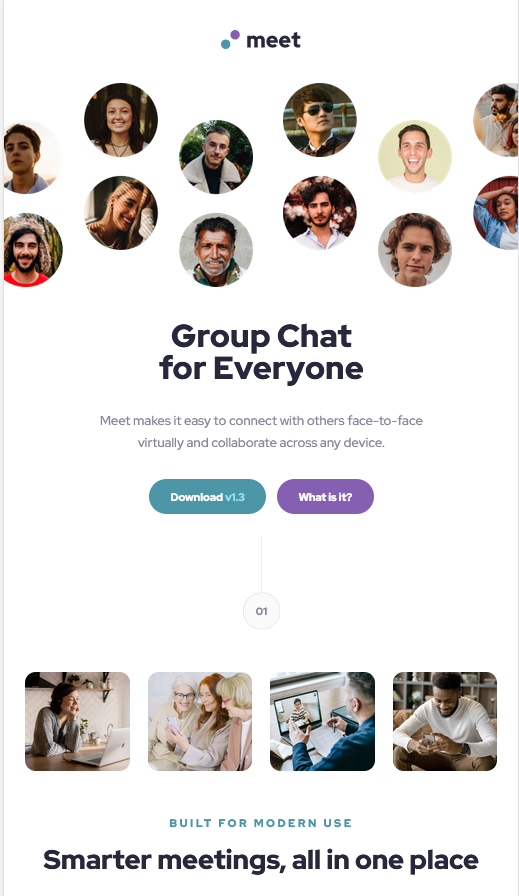
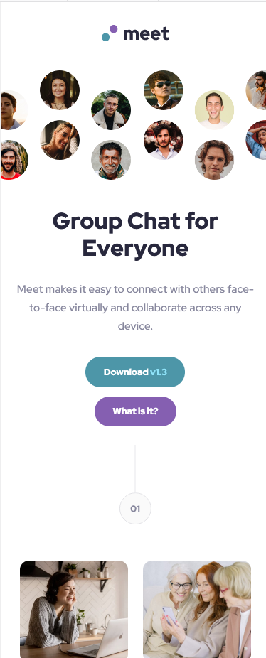

# Frontend Mentor - Meet landing page solution

This is a solution to the [Meet landing page challenge on Frontend Mentor](https://www.frontendmentor.io/challenges/meet-landing-page-rbTDS6OUR). Frontend Mentor challenges help you improve your coding skills by building realistic projects. 

## Table of contents

- [Overview](#overview)
  - [The challenge](#the-challenge)
  - [Screenshot](#screenshot)
  - [Links](#links)
- [My process](#my-process)
  - [Built with](#built-with)
  - [What I learned](#what-i-learned)
  - [Continued development](#continued-development)
  - [Useful resources](#useful-resources)
- [Author](#author)
- [Acknowledgments](#acknowledgments)

**Note: Delete this note and update the table of contents based on what sections you keep.**

## Overview

### The challenge

Users should be able to:

- View the optimal layout depending on their device's screen size
- See hover states for interactive elements

### Screenshot

<br>

Desktop

<br>



<br>

Tablet

<br>



<br>

Mobile

<br>




### Links

- Solution URL: [Check out the code here](https://github.com/TheCoderGuru/meet-landing-page/)
- Live Site URL: [Visit the live site here](https://meet-landing-page-iota.vercel.app/)

## My process

### Built with

- Semantic HTML5 markup
- CSS custom properties
- Flexbox
- CSS Grid
- Mobile-first workflow


### What I learned

This challenge proved me to be not too easy since I was a bit unsure how to achieve the desktop layout of the text in the center of the two images, then I decided that I can try using ```position: relative``` on the hero content and then use the following property ```top``` with a negated value which achieved the layout seen in the hero section. Secondly for the grid of the four images I used a bit of margin coupled with a bit of height to achieve the layout seen on the desktop.


### Continued development

My plan for continued development is to attempt more frontend mentor challenges in order to better my ability of eye-balling designs and getting it close enough using css properties.


### Useful resources

- [CSS Tricks - complete grid guide](https://css-tricks.com/snippets/css/complete-guide-grid/) - A comprehensive guide to css grids and everything that you need to know to use it in your next design.

- [MDN CSS Reference Guide](https://developer.mozilla.org/en-US/docs/Web/CSS) - The place to find all the properties about css.


## Author

- Frontend Mentor - [@TheCoderGuru](https://www.frontendmentor.io/profile/TheCoderGuru)
- Twitter - [@TheCoderGuru](https://www.twitter.com/TheCoderGuru)


## Acknowledgments


I would like to thank [Mariem Bchir](https://github.com/Mabchir/) who has really helped me by giving me a bit through the use of the design aspect of her solution I was able to correctly ensure that the hero section matched.

Check [her](https://www.frontendmentor.io/profile/Mabchir/) profile on Frontend Mentor to see her great work.